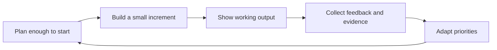
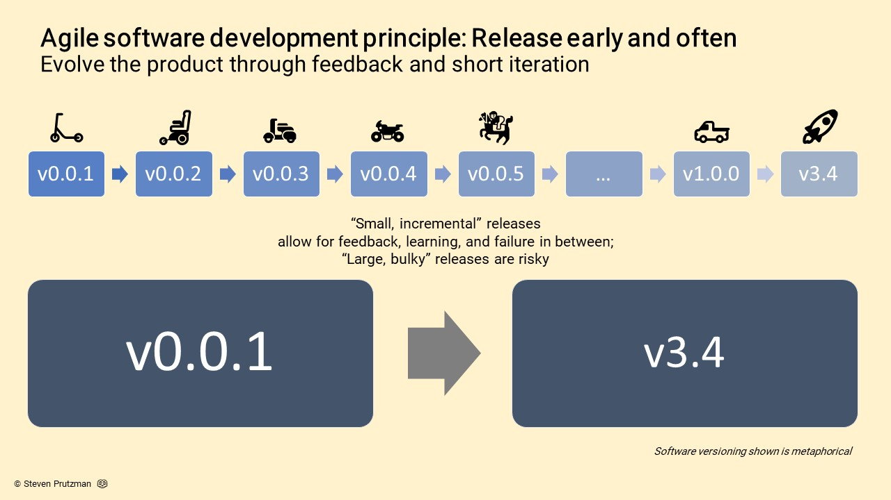
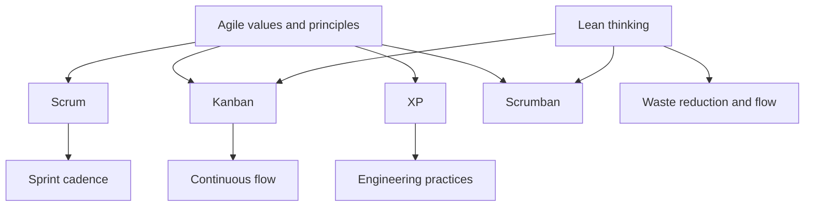

# Introduction to Agile Methodologies

Agile is a way of working for complex product development where teams learn
through short feedback loops, working increments, and close collaboration with
the people who use or sponsor the product. It is especially useful when the
problem is partly uncertain, the solution will evolve, and early evidence is
more valuable than a perfect upfront plan.

## Learning Objectives

By the end of this module, you should be able to:

- Explain what "agile" means in software and AI product work.
- Connect the Agile Manifesto values and principles to project decisions.
- Distinguish agile product delivery from traditional plan-driven delivery.
- Compare common agile approaches such as Scrum, Kanban, Lean, and XP.
- Decide when an agile approach is useful and when more upfront planning is
  still needed.

## Why Agile Exists

Traditional waterfall delivery assumes that the team can define the full scope,
schedule, and solution before most implementation begins. That can work when the
problem is stable and well understood, but software and AI projects often have
unknowns:

- user needs become clearer after prototypes are tested;
- technical constraints are discovered during implementation;
- data quality, model behavior, and integration risks appear late;
- stakeholder priorities change as the product becomes more concrete.

Agile approaches reduce this risk by delivering value in smaller increments and
using each increment to learn.

## Historical Context

Iterative and incremental development existed long before the word "agile" was
popular. In 2001, seventeen software practitioners wrote the
[Manifesto for Agile Software Development](https://agilemanifesto.org/) to
capture a shared alternative to heavyweight planning processes.

The manifesto does not prescribe one framework. Instead, it defines values and
principles that later methods such as Scrum, Kanban, XP, and Lean product
development can support in different ways.

Wikipedia's
[Agile software development](https://en.wikipedia.org/wiki/Agile_software_development)
article summarizes agile methods as iterative and incremental approaches where
requirements and solutions evolve through collaboration. That distinction
matters: agile work is not simply "smaller waterfall". The team releases or
reviews a small increment, learns from it, and then revises both the product and
the plan.

_Source: Wikimedia Commons, "Agile software development release early and
often.jpg" by Steveprutz, licensed under
[CC BY-SA 4.0](https://creativecommons.org/licenses/by-sa/4.0/)._

## The Four Agile Values

The Agile Manifesto states a preference for:

| Agile value | What it means in practice |
| --- | --- |
| Individuals and interactions over processes and tools | Tools help, but collaboration and shared understanding matter more. |
| Working software over comprehensive documentation | Documentation should support delivery, not replace usable outcomes. |
| Customer collaboration over contract negotiation | Stakeholders and users should shape the product throughout delivery. |
| Responding to change over following a plan | Plans are useful, but evidence should be allowed to change them. |

The second part of the manifesto is just as important: the items on the right
still have value. Agile does not mean "no process", "no documentation", or "no
planning". It means the left-hand side should guide decisions when trade-offs
appear.

## Principles to Remember

The Agile Manifesto includes twelve principles. For project management work,
these are the most operational ones:

- Deliver valuable working software frequently.
- Welcome changing requirements when they create customer advantage.
- Let business and technical people collaborate throughout the project.
- Build around motivated people and give them the support to succeed.
- Use working software as the primary measure of progress.
- Keep a sustainable pace instead of relying on repeated crunch periods.
- Improve through regular reflection and adjustment.
- Keep work simple by avoiding unnecessary effort.

## Agile Versus Waterfall

| Dimension | Waterfall tendency | Agile tendency |
| --- | --- | --- |
| Planning | Plan most details upfront | Plan enough, then adapt from evidence |
| Delivery | Large release after sequential phases | Smaller increments delivered regularly |
| Feedback | Later, after major milestones | Frequent, built into the workflow |
| Risk | Hidden until later phases | Exposed earlier through increments |
| Change | Often treated as disruption | Treated as expected learning |

Neither approach is universally better. Waterfall-style planning can be useful
for regulated, fixed-scope, or infrastructure-heavy work. Agile is stronger when
the team needs discovery, adaptation, and frequent stakeholder feedback.

## Common Agile Approaches

| Approach | Best fit | Main idea |
| --- | --- | --- |
| Scrum | Product teams that benefit from a shared sprint cadence | Deliver increments through fixed-length Sprints, clear accountabilities, and regular inspection. |
| Kanban | Teams with continuous incoming work or operational flow | Visualize work, limit work in progress, and improve flow continuously. |
| Lean | Teams optimizing value delivery and reducing waste | Understand customer value, improve flow, and remove non-value-adding work. |
| Extreme Programming (XP) | Engineering teams that need strong technical quality | Use practices such as test-driven development, pair programming, and continuous integration. |
| Scrumban | Teams blending sprint planning with continuous flow | Combine Scrum-style planning with Kanban visualization and WIP limits. |

Frameworks are not the goal. The goal is a working system that helps a team
deliver valuable outcomes, learn, and improve.

## Agile in AI and Data Products

AI projects add uncertainty that agile practices can help manage:

- A dataset may be incomplete, biased, noisy, or unavailable.
- A model may perform well offline but poorly in real user workflows.
- A prototype may reveal that users need a simpler decision aid, not a more
  complex model.
- Governance, privacy, and monitoring requirements may change the product
  design.

Useful agile behaviors for AI projects include time-boxed discovery, small
experiments, clear acceptance criteria, early stakeholder demos, and regular
reviews of data and model risks.

## Real-World Reference: Government Digital Services

The UK Government Service Manual describes agile delivery as a way to build
services in stages, test them with users, and keep improving them based on
evidence. This is a useful public-sector example because it connects agile
delivery to real users, service standards, and governance rather than treating
agile as a set of team rituals.

Read more:
[Agile and government services: an introduction](https://www.gov.uk/service-manual/agile-delivery/agile-government-services-introduction)

## Check Your Understanding

### Question 1

What is the primary reason agile teams deliver work in small increments?

- A. To avoid planning completely
- B. To learn from feedback and reduce risk earlier
- C. To remove the need for documentation
- D. To make every project shorter

Show solution

**Answer: B.** Small increments make progress visible, create opportunities for
feedback, and expose risks earlier than a large late-stage release.

### Question 2

Which statement best reflects the Agile Manifesto?

- A. Documentation has no value.
- B. Plans should never change.
- C. Working software is preferred over documentation that does not support
  delivery.
- D. Tools are more important than team communication.

Show solution

**Answer: C.** The manifesto values working software over comprehensive
documentation, while still recognizing that documentation can be useful.

### Question 3

When might a waterfall-style approach still be useful?

- A. When requirements are stable and compliance-heavy planning is required
- B. When users are unknown and the solution is experimental
- C. When the team wants frequent discovery loops
- D. When the product needs rapid prototype testing

Show solution

**Answer: A.** More upfront planning can be appropriate when scope, constraints,
and approval gates are stable and well understood.

### Question 4

Which agile approach is most focused on visualizing work and limiting work in
progress?

- A. Scrum
- B. Kanban
- C. XP
- D. Waterfall

Show solution

**Answer: B.** Kanban focuses on visualizing workflow, limiting work in
progress, managing flow, and improving the system over time.

## Key Takeaways

- Agile is a response to uncertainty in product development.
- The Agile Manifesto describes values and principles, not a single process.
- Scrum, Kanban, Lean, and XP support agile delivery in different ways.
- In AI and data projects, agile helps teams learn from experiments, user
  feedback, and technical evidence.

## Further Reading

- [Manifesto for Agile Software Development](https://agilemanifesto.org/)
- [Principles behind the Agile Manifesto](https://agilemanifesto.org/principles.html)
- [Agile software development on Wikipedia](https://en.wikipedia.org/wiki/Agile_software_development)
- [Iterative and incremental development](https://en.wikipedia.org/wiki/Iterative_and_incremental_development)
- [Wikimedia Commons: Agile release early and often](https://commons.wikimedia.org/wiki/File:Agile_software_development_release_early_and_often.jpg)
- [Agile and government services: an introduction](https://www.gov.uk/service-manual/agile-delivery/agile-government-services-introduction)
- [The Spotify Model for Scaling Agile](https://www.atlassian.com/agile/agile-at-scale/spotify)
