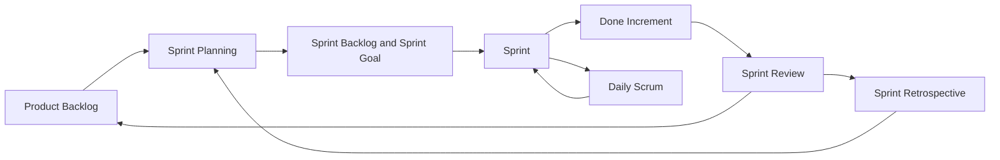
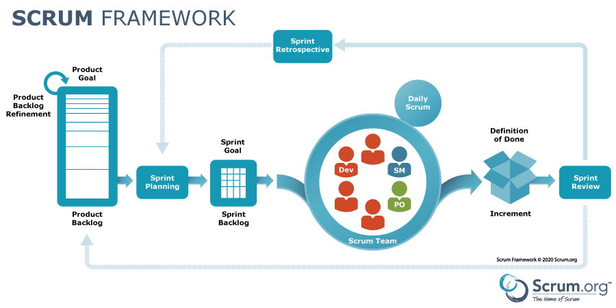
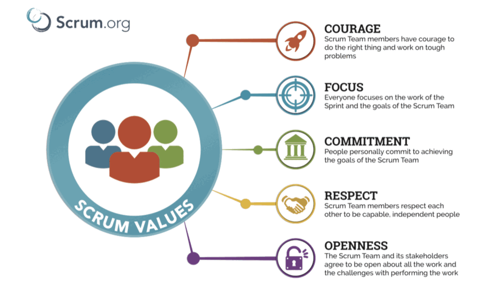
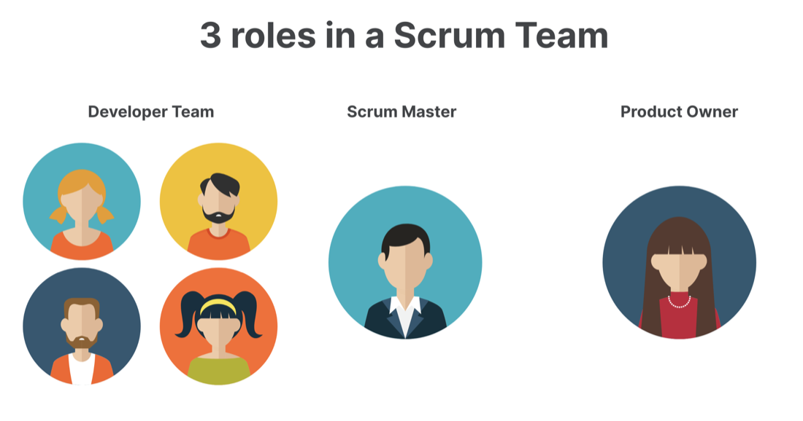
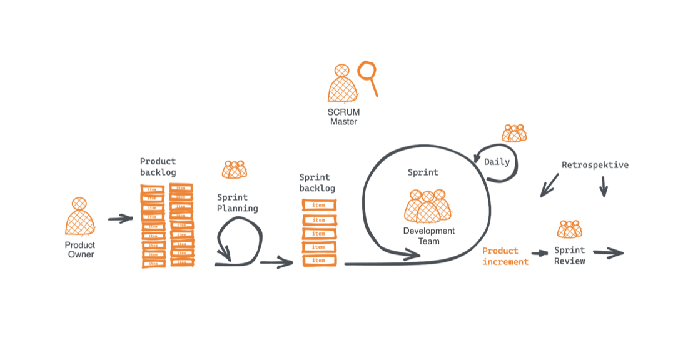
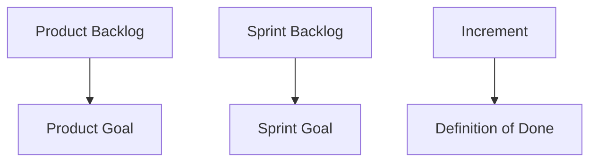

# Introduction to Scrum

Scrum is a lightweight framework for helping people, teams, and organizations
generate value through adaptive solutions to complex problems. It is not a
detailed project management methodology. Scrum defines a small set of
accountabilities, events, artifacts, and commitments, then relies on the team to
inspect, adapt, and improve how they work.

The definitive reference is the
[2020 Scrum Guide](https://scrumguides.org/scrum-guide.html), written by Ken
Schwaber and Jeff Sutherland.

## Learning Objectives

By the end of this module, you should be able to:

- Explain why Scrum is described as a framework rather than a methodology.
- Describe the Scrum Team accountabilities: Product Owner, Scrum Master, and
  Developers.
- Explain the purpose of the Sprint and the four formal events inside it.
- Connect Scrum artifacts to their commitments.
- Use Scrum terminology from the current Scrum Guide.
- Identify common misconceptions about Scrum.

## Scrum in One Page

Scrum creates a regular cycle for turning ideas into valuable increments.

_Source: Scrum.org Scrum framework poster._

## Historical Context

Scrum was introduced in the early 1990s by Ken Schwaber and Jeff Sutherland and
was presented publicly at OOPSLA in 1995. Its name was inspired by the 1986
Harvard Business Review article
[The New New Product Development Game](https://hbr.org/1986/01/the-new-new-product-development-game),
where Hirotaka Takeuchi and Ikujiro Nonaka used rugby as a metaphor for
cross-functional teams moving together rather than passing work sequentially
between departments.

Scrum later became closely associated with agile software development after the
Agile Manifesto was written in 2001. The Scrum Guide was first published in 2010
and is now the definitive source for Scrum terminology. The 2020 version
simplified the framework, changed "roles" language to "accountabilities", and
uses "Developers" instead of "Development Team".

For historical orientation, Wikipedia's
[Scrum article](https://en.wikipedia.org/wiki/Scrum_%28software_development%29)
is useful, but the current
[Scrum Guide](https://scrumguides.org/scrum-guide.html) should be treated as
the authority when terminology differs.

## Scrum Theory

Scrum is founded on empiricism and lean thinking:

- **Empiricism** means decisions are based on observation and experience.
- **Lean thinking** focuses on reducing waste and concentrating on essentials.

Scrum uses three pillars:

| Pillar | Meaning |
| --- | --- |
| Transparency | Important work, decisions, and artifacts are visible and understood. |
| Inspection | The team inspects progress and outcomes frequently enough to learn. |
| Adaptation | The team changes course when evidence shows that change is needed. |

## Scrum Values

Successful Scrum depends on five values:

| Value | What it looks like in practice |
| --- | --- |
| Commitment | The team commits to goals and supports each other. |
| Focus | The team focuses on the Sprint work and Sprint Goal. |
| Openness | The team and stakeholders are open about work, risks, and challenges. |
| Respect | Team members treat each other as capable, independent people. |
| Courage | The team addresses difficult problems and does the right thing. |

_Source: Scrum.org Scrum values poster._

## Scrum Team Accountabilities

The Scrum Team is a small, self-managing, cross-functional team. The current
Scrum Guide uses the word "Developers" for the people who create the product
Increment, regardless of job title.

| Accountability | Main responsibility |
| --- | --- |
| Product Owner | Maximizes product value and is accountable for effective Product Backlog management. |
| Scrum Master | Helps the team and organization understand and use Scrum effectively. |
| Developers | Create any aspect of a usable Increment each Sprint. |

## Scrum Events

The Sprint is the container event. All other Scrum events happen inside the
Sprint.

| Event | Purpose | Timebox |
| --- | --- | --- |
| Sprint | Turns ideas into value through a done Increment. | One month or less |
| Sprint Planning | Defines why the Sprint matters, what can be done, and how the work will be approached. | Up to 8 hours for a one-month Sprint |
| Daily Scrum | Lets Developers inspect progress toward the Sprint Goal and adapt the plan. | 15 minutes |
| Sprint Review | Inspects the Sprint outcome with stakeholders and adapts the Product Backlog. | Up to 4 hours for a one-month Sprint |
| Sprint Retrospective | Improves the team's process, quality, and collaboration. | Up to 3 hours for a one-month Sprint |

For shorter Sprints, the longer event timeboxes are usually shorter.

## Scrum Artifacts and Commitments

Scrum has three artifacts. Each artifact has a commitment that improves
transparency and focus.

| Artifact | Commitment | Purpose |
| --- | --- | --- |
| Product Backlog | Product Goal | Ordered work that describes what may be needed to deliver the product. |
| Sprint Backlog | Sprint Goal | The Developers' plan for the Sprint. |
| Increment | Definition of Done | The done, usable outcome created during a Sprint. |

The Definition of Done is especially important. Work that does not meet it is
not considered done, even if it has been demonstrated or partially completed.

## Common Misconceptions

| Misconception | More accurate view |
| --- | --- |
| Scrum is a complete methodology. | Scrum is a lightweight framework; teams still choose supporting practices. |
| The Scrum Master manages the team. | The Scrum Master serves the team and helps Scrum work; the team is self-managing. |
| The Product Owner writes every requirement alone. | The Product Owner is accountable for the backlog, but backlog refinement is collaborative. |
| Daily Scrum is a status meeting for managers. | Daily Scrum is for Developers to inspect and adapt their plan. |
| Sprint Zero is a required Scrum event. | Sprint Zero is not part of Scrum. Some teams use preparation time, but it is not a formal event. |

## Certification Context

Scrum certification can be useful if you want a structured study goal or need a
recognized credential. It is not required to practice Scrum well.

Two common certification providers are Scrum.org and
[Scrum Alliance](https://www.scrumalliance.org/).

Always check the provider's current exam rules, renewal policy, pricing, and
course requirements before planning a certification path.

## Check Your Understanding

### Question 1

Is Scrum a methodology that tells a team exactly how to build software?

Show solution

**Answer: No.** Scrum is a lightweight framework. It defines essential elements
and leaves many process and engineering practices for the team to choose.

### Question 2

Who is accountable for ordering the Product Backlog?

Show solution

**Answer: The Product Owner.** The Product Owner is accountable for maximizing
product value and for effective Product Backlog management, including ordering.

### Question 3

Who owns the Sprint Backlog?

Show solution

**Answer: The Developers.** The Sprint Backlog is the Developers' plan for the
Sprint and may be adapted as they learn.

### Question 4

Who must attend the Daily Scrum?

Show solution

**Answer: Developers.** The Daily Scrum is for Developers. The Product Owner or
Scrum Master participate if they are actively working on Sprint Backlog items as
Developers.

### Question 5

When can a Sprint be canceled, and who can cancel it?

Show solution

**Answer: A Sprint can be canceled if the Sprint Goal becomes obsolete.** Only
the Product Owner has the authority to cancel the Sprint.

### Question 6

What are the three Scrum artifact commitments?

Show solution

**Answer:** Product Goal, Sprint Goal, and Definition of Done.

### Question 7

What should Developers do if they realize during the Sprint that the selected
work is too much?

Show solution

**Answer:** They should inspect the situation, adapt their plan, and collaborate
with the Product Owner if the scope selected for the Sprint needs to be
adjusted.

### Question 8

True or false: Developers never meet stakeholders; only the Product Owner does.

Show solution

**Answer: False.** Stakeholder collaboration is important, especially during the
Sprint Review. The Product Owner manages product direction, but Scrum does not
forbid Developers from interacting with stakeholders.

## Key Takeaways

- Scrum is a lightweight framework for complex work.
- The current Scrum Team accountabilities are Product Owner, Scrum Master, and
  Developers.
- The Sprint is the container for Scrum's events.
- The three artifact commitments are Product Goal, Sprint Goal, and Definition
  of Done.
- Scrum works through transparency, inspection, and adaptation.

## Further Reading

- [The 2020 Scrum Guide](https://scrumguides.org/scrum-guide.html)
- [Scrum on Wikipedia](https://en.wikipedia.org/wiki/Scrum_%28software_development%29)
- [The New New Product Development Game](https://hbr.org/1986/01/the-new-new-product-development-game)
- [What is Scrum?](https://www.scrumalliance.org/about-scrum)
