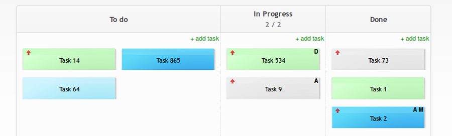
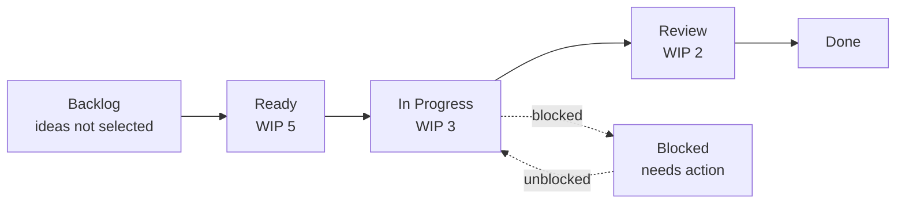

# Introduction to Kanban

Kanban is a strategy for optimizing the flow of value through a process. It
helps teams make work visible, limit work in progress, inspect flow, and improve
the system collaboratively. Unlike Scrum, Kanban does not require a Sprint
cadence or predefined team accountabilities.

The official reference is
[The Kanban Guide](https://kanbanguides.org/), which describes Kanban as a
minimal strategy for improving flow in knowledge work.

## Learning Objectives

By the end of this module, you should be able to:

- Explain Kanban's purpose and historical roots.
- Build and interpret a simple Kanban board.
- Explain why work-in-progress limits matter.
- Distinguish lead time, cycle time, throughput, and blocked work.
- Decide when Kanban is a better fit than a Sprint-based workflow.
- Identify common mistakes when adopting Kanban.

## Historical Context

The word "kanban" is Japanese and is commonly translated as "signboard" or
"visual signal". In manufacturing, a kanban card signals that downstream demand
exists and that upstream work or replenishment should happen.

Kanban is closely associated with the
[Toyota Production System](https://www.lean.org/lexicon-terms/toyota-production-system/).
Lean Enterprise Institute describes TPS as a system for providing quality, low
cost, and short lead time through waste reduction, with just-in-time and jidoka
as central pillars. Taiichi Ohno is widely credited with leading the development
of TPS at Toyota after World War II.

Toyota's official company history explains that kanban was introduced to support
just-in-time production through a "supermarket" style of replenishment: upstream
work is triggered by downstream consumption rather than by pushing work forward
from a central schedule.

In software and service work, the physical production card became a visual
workflow system. The modern Kanban Method uses the same pull-system idea in a
knowledge-work context: visualize work, limit work in progress, manage flow, and
improve the system through feedback.

Important milestones:

| Period | Development |
| --- | --- |
| 1940s-1960s | Toyota develops TPS and uses kanban signaling to support just-in-time flow. |
| 1980s-1990s | Lean production becomes internationally influential through research and industrial adoption. |
| 2000s | Kanban is adapted for software, IT operations, and knowledge work. |
| 2010s onward | Kanban boards become common in product teams, support teams, platform teams, and service delivery. |

## Why Kanban Helps

Knowledge work often becomes difficult because too much is invisible:

- work waits in queues without a clear owner;
- people start more tasks than they can finish;
- blockers are discovered late;
- urgent requests interrupt planned work;
- stakeholders see activity but not flow.

Kanban makes this system visible so the team can improve it.

## A Simple Kanban Board

A basic Kanban board might look like this:

_Source: Wikimedia Commons, "Basic-kanban-board.png" by Bossarro, licensed
under [CC BY-SA 4.0](https://creativecommons.org/licenses/by-sa/4.0/)._

The board should represent the actual workflow, not an idealized workflow. If
work regularly waits for legal review, data access, model evaluation, or
stakeholder sign-off, that waiting state should be visible.

GitHub Projects can be used as a practical Kanban board. In a board view, cards
move between columns based on a field such as **Status**, and teams can add
column limits to make overload visible.

_Source: GitHub Docs, "Customizing the board layout"._

## Core Kanban Practices

| Practice | Purpose |
| --- | --- |
| Visualize the workflow | Make work, queues, blockers, and handoffs visible. |
| Limit work in progress | Reduce multitasking and expose capacity constraints. |
| Manage flow | Improve how smoothly work moves from commitment to completion. |
| Make policies explicit | Define how work enters, moves, pauses, and exits the system. |
| Implement feedback loops | Review delivery, quality, priorities, and improvement opportunities. |
| Improve collaboratively | Use evidence and experiments to improve the system over time. |

## Work-in-Progress Limits

A WIP limit caps how much work may sit in a workflow state at one time. For
example, an "In Progress" column with a WIP limit of three means the team should
finish or unblock existing work before starting a fourth item.

WIP limits help because they:

- reduce context switching;
- reveal bottlenecks;
- make blockers more urgent;
- improve predictability;
- encourage finishing over starting.

WIP limits are not punishment. They are a signal that the system is overloaded
and needs attention.

## Flow Metrics

Kanban teams often inspect flow with a few simple metrics:

| Metric | Meaning | Example question |
| --- | --- | --- |
| Lead time | Time from request or commitment to delivery | How long does a user wait? |
| Cycle time | Time from active work start to completion | How long does work take once started? |
| Throughput | Number of completed items in a period | How many items do we finish per week? |
| Work in progress | Number of active unfinished items | Are we overloaded? |
| Blocked time | Time work spends unable to move | Where does work get stuck? |

Metrics should support learning, not individual performance ranking. Kanban is
about managing the work and the system, not micromanaging people.

## Explicit Policies

Kanban works better when the rules of the board are visible. Useful policies
include:

- what makes an item ready to start;
- who can pull work into each column;
- what counts as blocked;
- when urgent work can bypass the normal queue;
- what "Done" means;
- how WIP limits are handled when they are exceeded.

Good policies reduce confusion and make improvement discussions concrete.

## When Kanban Fits Well

Kanban is often a strong choice for:

- support and operations teams with continuous incoming requests;
- product teams balancing roadmap work with urgent interruptions;
- platform teams serving multiple internal customers;
- AI teams managing experiments, data access, model evaluation, and deployment
  tasks;
- teams that need to improve an existing workflow without reorganizing
  immediately.

Scrum can be stronger when a team benefits from a shared Sprint cadence, Sprint
Goals, and formal Sprint Reviews. Many teams combine ideas from both, but they
should be clear about which rules they are actually using.

## Practical Scenario: Platform Team Support Flow

Imagine a platform team that receives requests from several product teams:
access to data, cloud environment changes, model deployment support, and urgent
incident help. A Sprint plan alone may not handle this work well because new
requests arrive continuously.

A Kanban system can help the team:

- separate planned work from urgent support;
- make waiting states visible, such as "Waiting for requester" or "Security
  review";
- set WIP limits so the team does not start too much at once;
- review blocked work regularly;
- improve policies for intake, prioritization, and handoff.

This kind of workflow is a common reason teams choose Kanban or combine Kanban
with another agile framework.

## Practice Prompt

Use the [session handout](05-session-handout.md) to sketch a Kanban board for a
project workflow, add WIP limits, and identify one bottleneck.

## Check Your Understanding

### Question 1

What is the main purpose of visualizing work in Kanban?

Show solution

**Answer:** Visualization makes the real workflow, queues, blockers, and
handoffs visible so the team can manage and improve flow.

### Question 2

Why do WIP limits often improve delivery?

Show solution

**Answer:** They reduce multitasking, expose bottlenecks, and encourage teams to
finish existing work before starting more work.

### Question 3

What is the difference between lead time and cycle time?

Show solution

**Answer:** Lead time usually measures the time from request or commitment to
delivery. Cycle time measures the time from active work start to completion.

### Question 4

True or false: Kanban requires fixed-length Sprints.

Show solution

**Answer: False.** Kanban can be used with continuous flow and does not require
Sprints. Some teams combine Kanban with Sprint-based planning, but that is a
hybrid choice.

## Key Takeaways

- Kanban optimizes flow by making work visible.
- WIP limits help teams finish more by starting less.
- Explicit policies make the workflow easier to understand and improve.
- Flow metrics should help teams improve the system, not rank individuals.
- Kanban is especially useful for continuous, interrupt-driven, or service-style
  work.

## Further Reading

- [The Kanban Guide](https://kanbanguides.org/)
- [Wikimedia Commons: Basic Kanban board](https://commons.wikimedia.org/wiki/File:Basic-kanban-board.png)
- [Kanban on Wikipedia](https://en.wikipedia.org/wiki/Kanban)
- [Kanban board on Wikipedia](https://en.wikipedia.org/wiki/Kanban_board)
- [Toyota Production System](https://www.lean.org/lexicon-terms/toyota-production-system/)
- [Toyota history: Development and Deployment of TPS](https://www.toyota-global.com/company/history_of_toyota/75years/text/entering_the_automotive_business/chapter1/section4/item4.html)
- [Kanban: A brief introduction](https://www.atlassian.com/agile/kanban)
- [What is a Kanban board?](https://www.atlassian.com/agile/kanban/boards)
