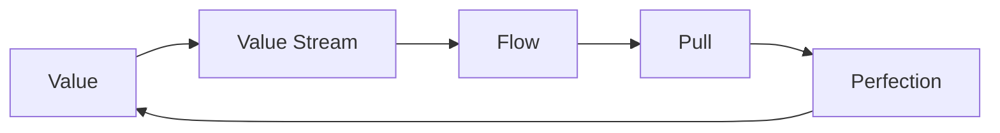
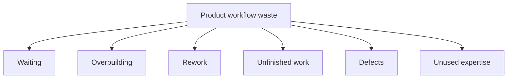
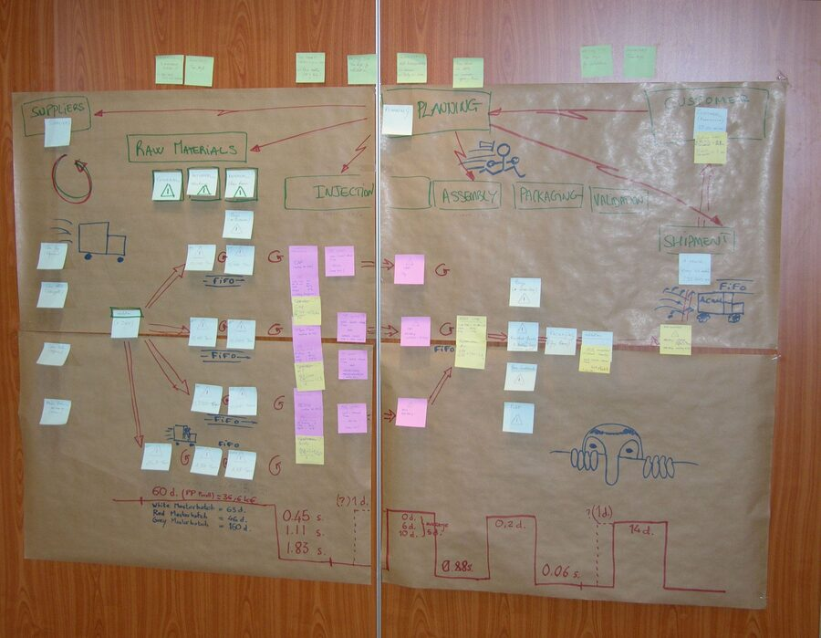

# Introduction to Lean

Lean is a way of thinking and working that focuses on creating customer value
with fewer resources and less waste. It is not just a cost-cutting method. In
knowledge work, Lean helps teams understand what creates value, improve flow,
learn through experimentation, and respect the people doing the work.

The Lean Enterprise Institute describes Lean as both thinking and practice:
understand the customer's problem, improve the work that creates value, and keep
learning continuously.

## Learning Objectives

By the end of this module, you should be able to:

- Explain the purpose of Lean in product and project work.
- Describe the five Lean principles.
- Identify common forms of waste in software and AI projects.
- Connect Lean, Agile, Scrum, and Kanban without treating them as identical.
- Use Lean questions to improve a project workflow.

## Historical Context

Lean is strongly associated with the Toyota Production System, which emphasized
flow, quality, just-in-time production, continuous improvement, and respect for
people. The term "Lean" later became common in management and product
development literature to describe the broader approach of creating more value
with less waste.

Today, Lean ideas are used in manufacturing, healthcare, software, service
design, product management, and startups. The details differ by context, but the
central question remains stable: what creates value for the customer, and what
gets in the way?

Lean Enterprise Institute's
[brief history of Lean](https://www.lean.org/explore-lean/a-brief-history-of-lean/)
traces the story from early flow production to Ford's moving assembly line and
then to Toyota's post-war production system. Ford showed the power of flow for a
highly standardized product; Toyota adapted flow to a context that required more
variety, smaller batches, faster changeovers, and pull-based replenishment.

Wikipedia's
[Lean manufacturing](https://en.wikipedia.org/wiki/Lean_manufacturing) article
is useful for orientation because it connects Lean to TPS, waste reduction,
just-in-time, jidoka, 5S, Kanban, and value-stream mapping. In this course,
treat Wikipedia as a map of the topic and Lean Enterprise Institute as a more
authoritative Lean reference.

## The Five Lean Principles

| Principle | Product management interpretation |
| --- | --- |
| Value | Understand the customer's problem and what outcome would genuinely help. |
| Value Stream | Map the steps needed to deliver that value, including delays and handoffs. |
| Flow | Remove interruptions, rework, and bottlenecks so value can move smoothly. |
| Pull | Start work based on real demand and capacity, not just wishful planning. |
| Perfection | Keep improving through learning, experimentation, and reflection. |

## Lean Waste in Software and AI Projects

Waste is any activity that consumes time, money, attention, or capacity without
creating meaningful value. In knowledge work, waste is often less visible than
in manufacturing.

| Waste pattern | Software or AI example |
| --- | --- |
| Waiting | A model deployment waits two weeks for data access approval. |
| Overproduction | The team builds features before validating user need. |
| Rework | Ambiguous requirements cause repeated redesign and refactoring. |
| Overprocessing | Reports, dashboards, or model complexity exceed the decision need. |
| Inventory | Many started experiments sit unfinished. |
| Motion | People search across tools for context that should be easy to find. |
| Defects | Data quality issues or bugs create support work and loss of trust. |
| Unused talent | Decisions are made without involving the people closest to the work. |

Lean does not mean removing all slack. Some slack is necessary for learning,
quality, resilience, and improvement.

## Lean Tools and Techniques

| Technique | Use |
| --- | --- |
| Value Stream Mapping | Visualize the steps, delays, and handoffs in a workflow. |
| Kanban | Manage work visually and improve flow through WIP limits. |
| Kaizen | Make continuous, incremental improvements. |
| 5S | Organize a workspace or information environment so work is easier to do. |
| Just-in-Time | Reduce unnecessary inventory by producing based on demand. |
| Poka-Yoke | Prevent errors through process or design choices. |
| A3 Thinking | Structure problem solving on one page: context, analysis, countermeasures, and follow-up. |

In product and AI work, these tools should support learning and value delivery.
They should not become process theatre.

Value-stream mapping is one of the most useful Lean tools for project managers
because it makes the whole flow visible: requests, work steps, waiting time,
handoffs, information flow, and delivery. In software or AI work, the "map" may
track a feature, experiment, model release, data access request, or support
workflow rather than a physical product.

_Source: Wikimedia Commons, "Value Stream Mapping map 015.jpg" by Adrian
Grycuk, licensed under
[CC BY-SA 3.0](https://creativecommons.org/licenses/by-sa/3.0/)._

## Lean, Agile, Scrum, and Kanban

| Concept | Main focus | Relationship |
| --- | --- | --- |
| Lean | Value, waste reduction, flow, learning | Broad management and improvement philosophy |
| Agile | Adaptation through feedback and incremental delivery | Product development values and principles |
| Scrum | Team framework for complex product work | Can support Agile and Lean thinking |
| Kanban | Flow strategy using visualization and WIP limits | Strongly aligned with Lean flow principles |

The methods overlap, but they are not synonyms. A Scrum team can still create
waste. A Kanban board can still hide poor priorities. Lean thinking asks whether
the whole system is creating value.

## Lean Questions for Project Managers

Use these questions during planning, delivery reviews, and retrospectives:

- What customer problem are we solving?
- Which work directly creates value?
- Where does work wait?
- Where do we create rework?
- What decision are we trying to support?
- What is the smallest useful experiment?
- Which policy, handoff, or approval slows flow without improving quality?
- What should we stop doing?

## Practice Prompt

Use the [session handout](05-session-handout.md) to map a workflow, identify
waiting points, and propose one small experiment to reduce waste.

## Check Your Understanding

### Question 1

What is Lean primarily trying to improve?

Show solution

**Answer:** Lean aims to improve the creation of customer value by reducing
waste, improving flow, and supporting continuous learning.

### Question 2

Why is "overproduction" a form of waste in product work?

Show solution

**Answer:** Building features, reports, or models before validating need can
consume capacity without creating value. It may also create maintenance and
quality costs.

### Question 3

How is Lean different from Scrum?

Show solution

**Answer:** Lean is a broad thinking and improvement approach focused on value,
waste, flow, and learning. Scrum is a lightweight team framework with specific
accountabilities, events, artifacts, and commitments.

### Question 4

True or false: Lean means removing every pause or buffer from a workflow.

Show solution

**Answer: False.** Lean reduces waste, but healthy slack can be important for
learning, quality, resilience, and continuous improvement.

## Key Takeaways

- Lean starts with customer value and the work needed to create it.
- Waste in software and AI work often appears as waiting, rework, overbuilding,
  unclear decisions, and unfinished work.
- Lean and Agile are compatible, but they are not the same thing.
- Kanban is strongly connected to Lean because it improves flow and limits
  overload.
- Good Lean practice respects people and improves the system around them.

## Further Reading

- [What is Lean?](https://www.lean.org/explore-lean/what-is-lean/)
- [A Brief History of Lean](https://www.lean.org/explore-lean/a-brief-history-of-lean/)
- [Lean manufacturing on Wikipedia](https://en.wikipedia.org/wiki/Lean_manufacturing)
- [Value Stream Mapping](https://www.lean.org/lexicon-terms/value-stream-mapping/)
- [Value-stream mapping on Wikipedia](https://en.wikipedia.org/wiki/Value-stream_mapping)
- [Wikimedia Commons: Value Stream Mapping map](https://commons.wikimedia.org/wiki/File:Value_Stream_Mapping_map_015.jpg)
- [Understanding Lean Transformation](https://www.lean.org/the-lean-post/articles/understanding-lean-transformation/)
- [What is Lean methodology?](https://www.atlassian.com/agile/project-management/lean-methodology)
