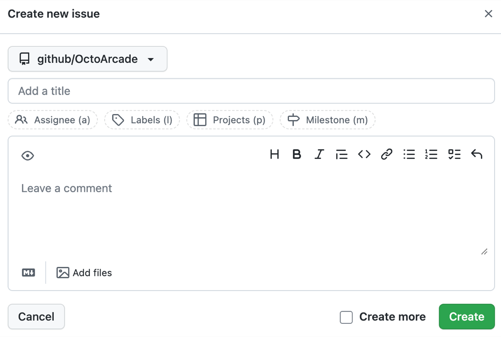
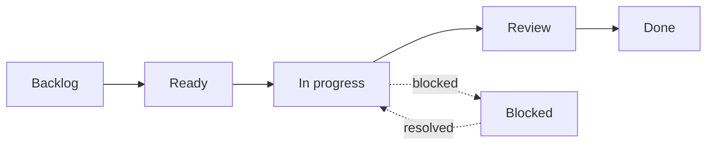
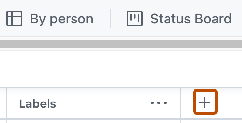
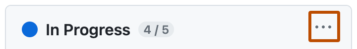

# Session Handout: Run a GitHub Projects Kanban Board

This activity turns Agile, Scrum, Kanban, and Lean concepts into a hands-on
group exercise. Your group will use a real
[GitHub Projects](https://docs.github.com/en/issues/planning-and-tracking-with-projects)
board to plan, prioritize, move, and review work for a small AI product
scenario.

Use the official GitHub documentation as the reference for setup:

- [Quickstart for Projects](https://docs.github.com/en/issues/planning-and-tracking-with-projects/learning-about-projects/quickstart-for-projects)
- [Creating a project](https://docs.github.com/en/issues/planning-and-tracking-with-projects/creating-projects/creating-a-project)
- [Adding items to your project](https://docs.github.com/en/issues/planning-and-tracking-with-projects/managing-items-in-your-project/adding-items-to-your-project)
- [Customizing the board layout](https://docs.github.com/en/issues/planning-and-tracking-with-projects/customizing-views-in-your-project/customizing-the-board-layout)
- [Adding your project to a repository](https://docs.github.com/en/issues/planning-and-tracking-with-projects/managing-your-project/adding-your-project-to-a-repository)

## Scenario

Your team is asked to build an internal AI assistant that helps colleagues find
answers in company policy documents. The first version should support a small
pilot group, use approved documents only, and give users a way to report
incorrect or unclear answers.

Known constraints:

- The pilot must be useful within four weeks.
- The legal team needs to review the answer-disclaimer wording.
- The data source may change after the first stakeholder demo.
- The team has one product lead, two developers, one data specialist, and one
  part-time subject-matter expert.
- Stakeholders want visibility into progress and risks.

## Group Roles

Assign roles before opening GitHub.

| Role | Responsibility |
| --- | --- |
| Product lead | Defines value, priorities, and what is out of scope. |
| Flow manager | Watches WIP limits, blockers, and column movement. |
| Documentation lead | Writes clear issue titles and issue descriptions. |
| Stakeholder reviewer | Challenges assumptions and asks for evidence. |

If the group is small, combine roles. If the group is large, split into two
boards and compare decisions at the end.

<details>
<summary>Show example role split</summary>

For a group of four:

| Person | Role |
| --- | --- |
| Person 1 | Product lead |
| Person 2 | Flow manager |
| Person 3 | Documentation lead |
| Person 4 | Stakeholder reviewer |

For a group of two, combine Product lead with Stakeholder reviewer, and combine
Flow manager with Documentation lead.

</details>

## Part 1: Create or Open the Repository

Use the course repository created from the template. If your group already has a
repository, open it on GitHub.

Open the repository's **Projects** tab.


_Source: GitHub Docs, "Adding your project to a repository"._

If no Project is linked yet:

1. Click **Projects** in the repository.
2. Click **Link a project** if your group already created one.
3. Otherwise create a new Project from your profile or organization.
4. Choose **Board** under **Start from scratch**.
5. Name it `AI Assistant Pilot Board`.

GitHub Projects can track issues, pull requests, and draft issues. For this
activity, use issues whenever possible so the work is connected to the
repository.

<details>
<summary>Show setup check</summary>

By the end of this part, the group should have:

- one repository open on GitHub;
- one linked GitHub Project named `AI Assistant Pilot Board`;
- a board layout selected;
- all group members able to view the board.

</details>

## Part 2: Create the First Issues

Create at least eight issues for the scenario. Each issue should be small enough
to move across the board during the activity.



_Source: GitHub Docs, "Adding items to your project"._

Use this structure for each issue:

```text
Title:

As a <user or stakeholder>,
I want <capability or decision>,
so that <value or risk reduction>.

Done when:
- ...
- ...
```

Suggested starter issues:

| Issue | Purpose |
| --- | --- |
| Define pilot user group | Clarify who the first version serves. |
| Select approved policy documents | Prevent the assistant from using unapproved sources. |
| Draft answer disclaimer | Prepare wording for legal review. |
| Create feedback path for bad answers | Let users report wrong or unclear responses. |
| Define success metrics | Decide what evidence makes the pilot useful. |
| Build first retrieval prototype | Create a small working increment. |
| Review data quality risks | Identify missing, outdated, or conflicting documents. |
| Prepare stakeholder demo | Show progress and gather feedback. |

Add each issue to the Project. GitHub lets you add items from the Project
itself, paste issue URLs into the Project, or assign a Project from inside an
issue.

<details>
<summary>Show example issue</summary>

```text
Title: Define pilot user group

As a product lead,
I want to identify the first pilot user group,
so that the assistant is tested with a clear audience and realistic questions.

Done when:
- The pilot group is named.
- The group size is agreed.
- The main user need is written in one sentence.
- One stakeholder confirms the pilot group is appropriate.
```

A good issue is small, testable, and connected to a decision or user value. If
an issue contains several different outcomes, split it before moving it to
**Ready**.

</details>

## Part 3: Configure the Board

Create a board view if the Project does not already have one.


_Source: GitHub Docs, "Quickstart for Projects"._

Use these columns:



Recommended meaning:

| Column | Meaning |
| --- | --- |
| Backlog | Useful work, but not selected yet. |
| Ready | Clear enough to start. |
| In progress | Actively being worked on. |
| Review | Waiting for feedback, validation, or approval. |
| Blocked | Cannot move because something outside the task is missing. |
| Done | Meets the issue's done criteria. |

GitHub board columns are controlled by a field such as **Status**. In the board
layout, dragging a card into another column changes that field value.

<details>
<summary>Show example board policy</summary>

| Column | Entry policy | Exit policy |
| --- | --- | --- |
| Backlog | The work may be useful but is not ready. | The product lead confirms it matters now. |
| Ready | The issue has done criteria and an owner. | The owner pulls it when capacity is available. |
| In progress | The work has started. | The work is ready for feedback or approval. |
| Review | A reviewer or stakeholder must inspect it. | The reviewer accepts it or requests changes. |
| Blocked | The issue cannot move without outside input. | The blocker is resolved and documented. |
| Done | The issue meets its done criteria. | No exit; reopen only if the done criteria were wrong. |

</details>

## Part 4: Add Fields for Better PM Decisions

Add fields so the group can discuss priority, effort, and ownership.



_Source: GitHub Docs, "Quickstart for Projects"._

Create or use these fields:

| Field | Type | Suggested values |
| --- | --- | --- |
| Priority | Single select | High, Medium, Low |
| Effort | Number | 1, 2, 3, 5 |
| Risk | Single select | Product, Technical, Legal, Data, None |
| Owner | Assignee | One responsible person |

Do not spend too long designing fields. The goal is to support decisions, not to
build a perfect tracking system.

<details>
<summary>Show example field values</summary>

| Issue | Priority | Effort | Risk | Owner |
| --- | --- | --- | --- | --- |
| Define pilot user group | High | 1 | Product | Product lead |
| Select approved policy documents | High | 3 | Legal | Data specialist |
| Draft answer disclaimer | High | 2 | Legal | Stakeholder reviewer |
| Build first retrieval prototype | High | 5 | Technical | Developer |
| Create feedback path for bad answers | Medium | 3 | Product | Developer |

This is only one possible setup. The important point is that the field values
make prioritization and discussion easier.

</details>

## Part 5: Apply WIP Limits

Set a column limit on **In progress**. Use a limit of `3` for a group of four to
six people, or `2` for a smaller group.



_Source: GitHub Docs, "Customizing the board layout"._

GitHub column limits communicate how a column should be used. They do not
prevent people or automations from adding more cards than the limit. If the
count exceeds the limit, treat it as a signal to stop starting and start
finishing.

<details>
<summary>Show WIP limit example</summary>

If the group has five people, set **In progress** to `3`.

When four cards appear in **In progress**, the group should not start a fifth
card. The better move is to:

1. finish one active card;
2. unblock one blocked card;
3. move one card to **Review**;
4. split an oversized card if it is stuck.

The limit is a conversation trigger, not a punishment.

</details>

## Part 6: Run the Board

Run three short rounds. Each round should take about five minutes.

### Round 1: Prioritize

1. Move only the most important issues into **Ready**.
2. Set **Priority**, **Effort**, **Risk**, and **Owner**.
3. Agree on the first useful increment.

### Round 2: Start Work

1. Pull cards from **Ready** into **In progress**.
2. Respect the WIP limit.
3. Move unclear cards back to **Backlog** or rewrite them.
4. Move blocked cards to **Blocked** and write the reason in the issue.

### Round 3: Review Flow

1. Move cards that need feedback to **Review**.
2. Move cards that meet their done criteria to **Done**.
3. Identify where cards waited, got blocked, or needed rework.
4. Adjust one board policy.

Examples of useful policies:

- A card cannot enter **Ready** without done criteria.
- A card in **Blocked** must include the blocker reason.
- **Review** cards need a named reviewer.
- **In progress** should stay at or below the WIP limit.

<details>
<summary>Show example round outcome</summary>

After three rounds, a reasonable board state might be:

| Column | Example cards |
| --- | --- |
| Backlog | Prepare stakeholder demo; define long-term maintenance owner |
| Ready | Create feedback path for bad answers |
| In progress | Build first retrieval prototype; review data quality risks |
| Review | Draft answer disclaimer |
| Blocked | Select approved policy documents |
| Done | Define pilot user group; define success metrics |

This outcome shows useful flow: some value is done, some work is active, one
legal or data dependency is visible, and the next work is ready without
overloading the group.

</details>

## Part 7: Lean Reflection

Use the board as evidence. Do not answer from memory only.

| Question | Group answer |
| --- | --- |
| Which card creates the clearest user value? |  |
| Where did work wait? |  |
| Which card was too large or unclear? |  |
| Which field helped decision-making most? |  |
| Which field or policy was unnecessary? |  |
| What should the group stop doing? |  |

<details>
<summary>Show example Lean reflection</summary>

| Question | Example answer |
| --- | --- |
| Which card creates the clearest user value? | Build first retrieval prototype, because it creates something users can try. |
| Where did work wait? | Legal review for the disclaimer and approval for policy documents. |
| Which card was too large or unclear? | Build first retrieval prototype may need to be split into document indexing, retrieval, and demo interface. |
| Which field helped decision-making most? | Risk, because legal and data risks changed priority. |
| Which field or policy was unnecessary? | Effort may be too detailed if the exercise is short. |
| What should the group stop doing? | Starting new cards before moving review or blocked cards forward. |

</details>

## Part 8: Team Recommendation

Prepare a two-minute recommendation.

```text
We recommend using <Scrum/Kanban/Hybrid> because...

Our first useful increment is...

Our GitHub Project board uses these columns...

Our WIP limit is...

The most important blocker or risk is...

The first process improvement we would try is...
```

<details>
<summary>Show example recommendation</summary>

```text
We recommend using a hybrid approach because the team needs a four-week
delivery goal, but the work also has continuous legal, data, and stakeholder
dependencies that should be visible on a Kanban board.

Our first useful increment is a retrieval prototype that answers questions from
a small set of approved policy documents and includes a feedback path for wrong
answers.

Our GitHub Project board uses Backlog, Ready, In progress, Review, Blocked, and
Done.

Our WIP limit is 3 for In progress.

The most important blocker or risk is approval of the policy document source and
the answer disclaimer.

The first process improvement we would try is requiring done criteria before a
card can move into Ready.
```

</details>

## Discussion Questions

1. Did the GitHub board make the work easier to understand?
2. Which issue should be split before the next iteration?
3. Did the WIP limit change group behavior?
4. What did the board show that a task list would have hidden?
5. Which approach fits this scenario best: Scrum, Kanban, or a hybrid?

<details>
<summary>Show example discussion answers</summary>

1. The board made dependencies and review work easier to see.
2. `Build first retrieval prototype` should probably be split before the next
   iteration.
3. The WIP limit pushed the group to finish or unblock work before starting
   more cards.
4. The board showed waiting work, blocked work, and review bottlenecks that a
   flat task list might hide.
5. A hybrid approach fits well: use a four-week goal and review rhythm, while
   using Kanban to manage continuous flow and blockers.

</details>
